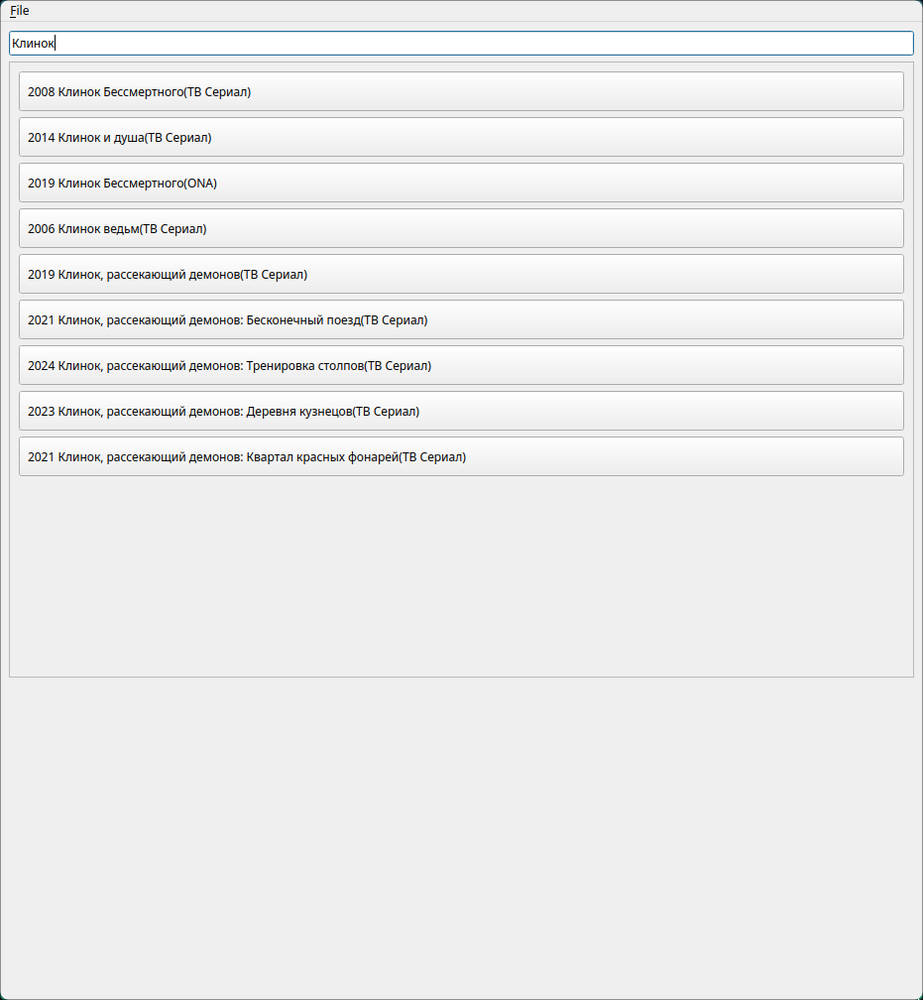

# AnimeWatch
AnimeWatch is a lightweight program for watching anime based on libcurl, libxml and Qt6.<br>Created only for educational purposes.

## How it works
When user is looking for a title, he is actually submitting request like 'https://animego.org/search/anime?q={title}' to the AnimeGO. Then the result of request is parsed with libxml and user receives episodes, dubs and links to episode.

## How to watch
AnimeWatch requires mpv media player to watch episodes. Another way out is to copy the link that appears after clicking on the dub.

## Build
The easiest way - open Qt Creator and build it here.<br>
Also you can build with combination of qmake6 and make:
```
qmake6 main.pro
make
```

